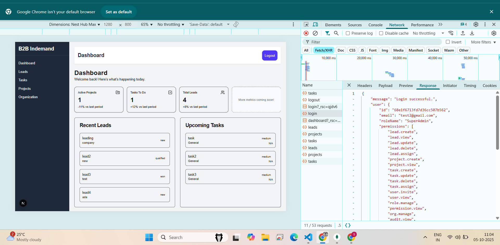
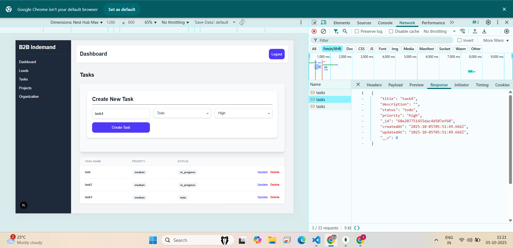

# Project Management Dashboard (Full Stack)

# Overview

This is a modern, full-stack web application designed for managing projects, tasks, and leads. The dashboard provides real-time metrics, allowing users to track active projects, daily tasks, and overall organizational performance. The application is built with a focus on a responsive user experience, scalability, and type safety.

# Features

User Authentication: Secure login and session management using cookies and credentials.
Project Management (CRUD): Full Create, Read, Update, and Delete functionality for projects.
Dynamic Dashboard: Real-time calculation and display of key performance indicators (KPIs) like Total Leads, Active Projects, and Tasks Today.
Responsive UI: Built with Tailwind CSS for a modern, mobile-friendly interface.
State Management: Optimized client-side state handling using React Hooks (useState, useEffect, useCallback).

# Tech Stack: 

# Frontend:

Framework:	Next.js (App Router)

Language:	TypeScript

Styling:	Tailwind CSS

Routing:	next/navigation (useRouter)

API Client:	Axios 

# Backend:

Runtime: 	    Node.js

Framework:	    Express.js

Database:	    MongoDB (NoSQL)

ODM: 	        Mongoose

Development:	Nodemon (Auto-reloading)

# Prerequisites
You need the following installed:

Node.js (LTS recommended)

npm or yarn

A running instance of MongoDB (Local or Atlas)

1. Clone the Repository
Bash

git clone "https://github.com/soniiya/B2BInDemand-Task.git"
cd "B2BInDemand-Task"

# 2. Install Dependencies
Install dependencies for both the frontend and backend.

Bash

# Install root dependencies
npm install

Navigate to the backend directory and install (if separated)
cd backend
npm install
cd ..

# 3. Environment Variables
Create a file named .env in the root of your project and add the following variables.

PORT=5000

MONGO_URI="mongodb://localhost:27017/b2bindemand"

JWT_SECRET="JWT_SECRET_KEY"

# 4. Run the Application
A. Start the Backend Server (API)
Run this command from your backend directory or configure your root package.json to start it.

Bash

npm run dev

5. Start the Frontend Application
Run this command from the root directory.

Bash

npm run dev

# Screenshots

This image shows the main dashboard after login.

This image shows Unauthorized acces to Dashboard.

Create Tasks/Projects/Leads if user is authenticated and autherized.

"Thank you so much"
